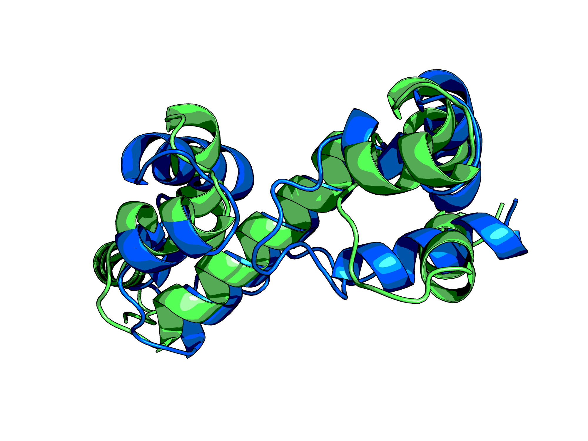

# Ab-Initio-Protein-Structure-Prediction

Using materials and methods of the article *"Ab initio protein structure prediction of CASP III targets using ROSETTA"* written by Kim T. Simons, Rich Bonneau, Ingo Ruczinski and David Baker, we conducted ab initio folding to generate structures consistent with both the local and nonlocal interactions responsible for protein stability.

To generate structures consistent we've implemented 3, 5 and 9 residue fragments of known structures into local sequences similar to the target sequence using a Monte Carlo simulated annealing procedure with further refinement of the obtained complete tertiary structure according to the article.

